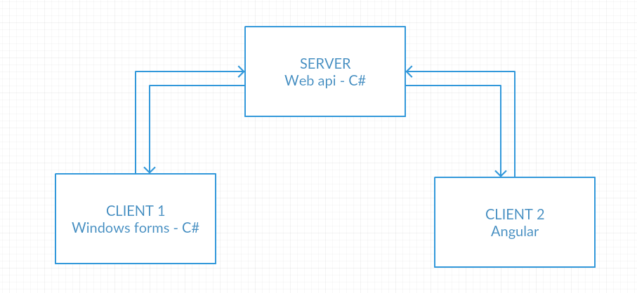
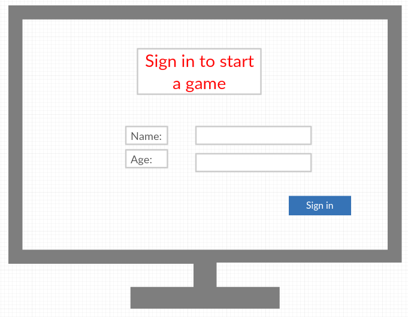
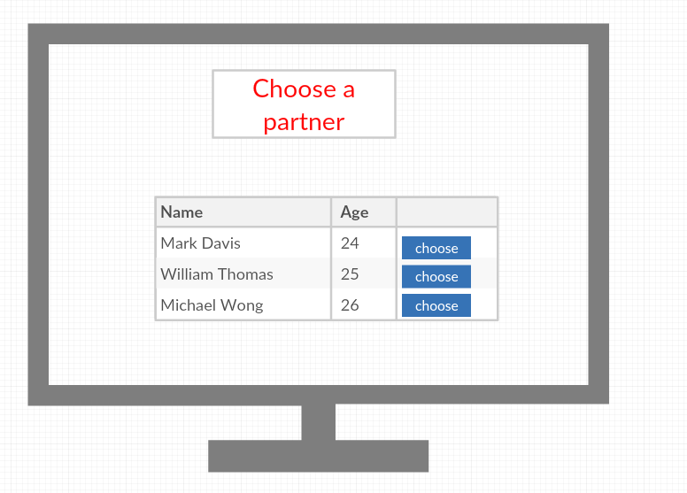
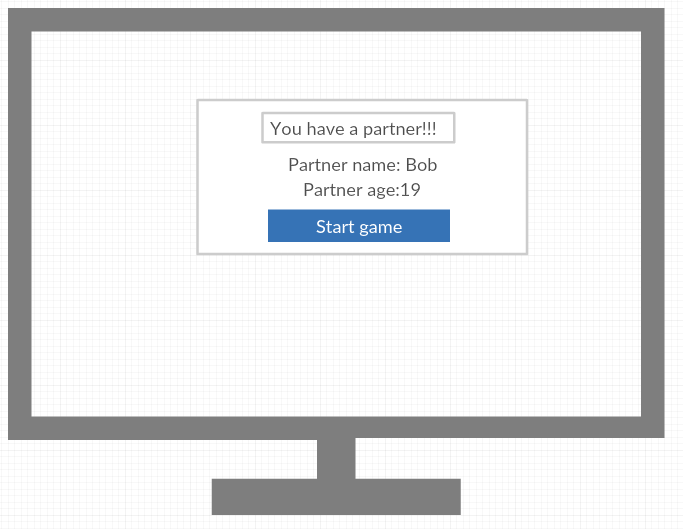
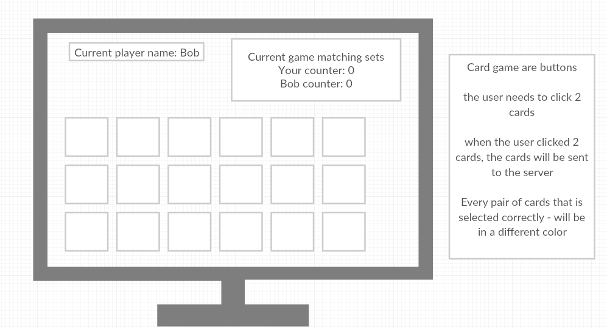

# Cross app - Memory Game

 ### this project was build by Efrat Zadok and Tamar Yankelevich

## Using this technologies:
* Web api
* WinForms
* Angular

## System diagram:

***
## Web api
### Models
* User:
    * UserName - string - minLength: 2, maxLength:10, reqiered, uniqe
    * Age - int - min: 18, max:120, reqiered
    * PartnerUserName - string 
    * Score - int - default value will be 0
* Game:
    * Player1 - `User` type
    * Player2 - `User` type
    * CurrentTurn - string - will contain the name of the player that owns the current turn
    * CardArray - `Dictionary<string, string>` with 9 elements
        * The key of each element is the card content
        * The value of each element is the name of the user that found the pair  
### Global Properties
* `List<User>`
* `List<Game>`

### Controllers
* User controller:
    * Post - sign in to a new game    
    requierd data: 
        * userName
        * age
    If the user is valid - we will add him to the UserList, and return true, Else - we will return a matching error
    * Get - get the list of the users that looks for a partner to the game (all the users that contains `null` in the `PartnerUserName` property)
    * Get - get the details of the current user
    * Put - The client sends a userName that he choosed to a partner.
    The server will update his details to the chosen partner. And the `PartnerUserName` property of chosen partner, to his name.   
    If the update completed succefuly - return true, And craete a new `Game` object with the 2 users as players, and the current userName as the `CurrentTurn`  
    Else - return a matching error.
* Game controller:
    * Get - get all cards and `CurrentTurn`
    * Put - The client sends a userName and the chosen cards results.
    The server will update the `Game` object `CurrentTurn` to the other player's name.   
    If the user managed to choose 2 cards with the same value - we will update the element in the `CardArray` that has the key of this card content - to the current user name.
    After the update it will check if the game is over (all the element in the `CardArray` contains value), If yes - the winner usrt will get 1 point to the `score` property.

***
## WinForms +  Angular
   
   
   
   
